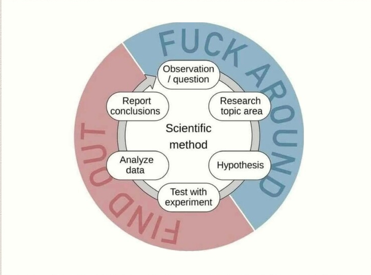

# Sentiment Analysis
## MetaData
Project members:
- Pablo Dario
- Sebastián Loeza
- Luis Daniel Moreno Santamaría  
patrocinado por:
- Raid: Shadow Legends
- NordVPN
- BetterHelp
- Honey
- Skillshare

## Preprocessing
usando un approach feature based estamos tomando embeddings generados por RoBERTa, un encoder que trabaja finamente parametrizado mediante el enmáscarado de tokens bidireccionales para usarlos en nuestro modelos LTSM y BERT.

## Experiment
*Which model will perform the best at classifying the emotions behind the tweets?*
the performance will be evaluated with the f1-score metric, since it is convenient to have summarized the Error type I and Error type II ratios in a single number.

Hypothesis: the fine tuning-based model will outperform the feature based approach of the LTSM
*methodology:*

## Results

## Conclusion

## Awknowledgements

We are grateful for the course & the resources created by Grant Sanderson (3b1b), alas we say goodbye and thanks 4 all the fish.